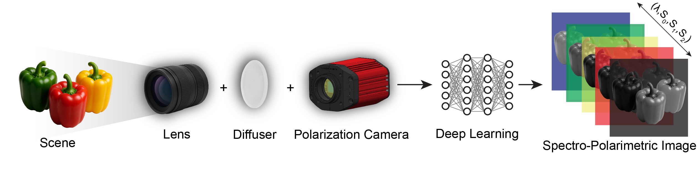

# 4DCam Software

<p align="center">
  
</p>

4DCam is a diffuser-encoded computational imaging system for recovering
four-dimensional optical information: space, wavelength, polarization, and time.
A thin passive diffuser maps wavelength-dependent scene content into single-shot
scatterograms, while a polarization-resolving CMOS sensor records four linear
polarization states. The software in this repository supports the reconstruction
and analysis pipeline around that hardware: probabilistic generative decoding,
uncertainty estimation, full-field video reconstruction, spectral-polarimetric
classification, image registration, video rendering, and multiplicative fusion
for spatial enhancement.

This repository accompanies the current project writeup,
[Four-dimensional video imaging via generative deep learning and a diffuser-encoded image sensor](https://arxiv.org/abs/2601.12162)
(arXiv:2601.12162). The paper describes the end-to-end 4DCam system and reports
4D video imaging of a live *Betta splendens* fish, along with material
discrimination experiments showing improved textile and camouflage classification
from the encoded 4D measurements. This codebase is the cleaned handoff point for
continuing that work.

The repository does not include raw datasets, trained model checkpoints, or full
generated result folders. Those files should live on local storage, CHPC scratch,
or an external release location and be referenced by path when running scripts.

## Repository Map

| Path | Purpose | Current Status |
| --- | --- | --- |
| `Probabalistic_UNET/` | Probabilistic pix2pix/U-Net reconstruction from Thorlabs inputs to Cubert-style hyperspectral outputs. Includes the cleaned probabilistic mean/scale head and the merged full-field `unet_2048` option. | Main reconstruction code path. |
| `Classification/` | Downstream classification code for textile and camouflage tasks. Includes older MobileNet/CNN code and the newer `roi_svm` reproduction package. | Mixed legacy and cleaned code. `roi_svm` is the most self-contained reproduction path. |
| `Image Processing/` | Registration, alignment, HDR preprocessing, augmentation, dark subtraction, and train/test split utilities. | Useful utilities, still path-heavy. |
| `Video Processing/` | Frame processing and spectral/Stokes/sRGB video rendering utilities. | Useful utilities, still path-heavy. |
| `Multiplicative Fusion/` | Spatial super-resolution by multiplicative fusion of low-resolution Cubert-style cubes with higher-resolution Thorlabs/scatterogram images. | Single-script implementation. |
| `Visualization/` | Lightweight viewers for hyperspectral outputs. | Utility scripts. |
| `figures/` | Small documentation figures, including the repository schematic. | Intended to remain in Git. |

## Environment

The codebase is Python-first. The most complete environment file currently lives
at:

```text
Probabalistic_UNET/env/hsp_env.yml
```

The `roi_svm` classification reproduction package also has:

```text
Classification/roi_svm/requirements.txt
```

For a new machine, start by creating the reconstruction environment from
`hsp_env.yml`, then install any extra requirements needed by the specific module
you are running. The project has grown through several experiments, so not every
legacy script has a fully isolated dependency file yet.

## Data Layout Conventions

Most paired reconstruction code expects an aligned dataset shaped like this:

```text
<dataroot>/
  training/
    thorlabs/
      *.tif
    cubert/
      *.tif
  validation/
    thorlabs/
      *.tif
    cubert/
      *.tif
```

The folder names can be overridden in the orchestration scripts. For example,
`Probabalistic_UNET/nll_train_test.py` supports per-dataset fields:

```python
{
    "name": "Umbrella_Video_aligned",
    "dataroot": "/scratch/general/nfs1/u1528328/Umbrella_Video/split",
    "checkpoints_dir": "/scratch/general/nfs1/u1528328/model_dir/nll_models/checkpoints_Umbrella_Video_retrain",
    "full_field": True,
    "train_phase": "training",
    "test_phase": "validation",
}
```

For video-only inference where Cubert targets are unavailable, use:

```python
"video_mode": True,
"skip_train": True,
```

Do not train with `video_mode=True` unless you intentionally want dummy targets.

## Probabilistic Reconstruction

The reconstruction module is in `Probabalistic_UNET/`. It is based on pix2pix,
with project-specific data loaders, hyperspectral losses, probabilistic output
heads, uncertainty calibration, and analysis utilities.

Key files:

- `train.py`: train one reconstruction model from command-line options.
- `test.py`: run inference for a saved checkpoint.
- `nll_train_test.py`: orchestrate training, testing, and metric evaluation over
  datasets and polarization angles.
- `models/networks.py`: generator/discriminator definitions.
- `models/pix2pix_model.py`: reconstruction losses, NLL logic, risk heads, and
  forward/backward passes.
- `data/aligned_dataset.py`: paired Thorlabs/Cubert dataloader with explicit
  model shape contracts.
- `HSI_comparison_probabalistic.py`: aggregate reconstruction metrics.
- `HSI_comparison_probabalistic_per_image.py`: per-image reconstruction metrics.
- `HSI_comparison_probabalistic_per_pixel.py`: per-pixel metric helpers.
- `calibrate_sigma_mae.py`: global uncertainty calibration.

### Model Variants

The cleaned probabilistic architecture uses two channel groups in the output:

- `mu`: reconstructed spectral image channels, passed through `sigmoid`.
- `sigma`: uncertainty/scale channels, passed through `softplus`.

With `--use_nll --output_nc 212`, the model outputs 106 mean channels and 106
scale channels. The NLL loss interprets the output as a Laplace likelihood.

Important generator options:

- `unet_1024`: default reconstruction model for standard aligned datasets.
- `unet_2048`: full-field option for `2048 x 2048` inputs and `410 x 410`
  targets. Use this through dataset entries with `"full_field": True`.
- `nafnet_128`, `nafnet_256`, `nafnet_512`, `nafnet_1024`: NAFNet comparison
  variants. These never worked as well and could use some help!

### Running Reconstruction

Edit the `DATASETS` list in `Probabalistic_UNET/nll_train_test.py`, then run:

```bash
cd Probabalistic_UNET
python nll_train_test.py --dataset banknotes_augmented
```

To override all dataset-selected models for a one-off run:

```bash
python nll_train_test.py --dataset banknotes_augmented --netG unet_2048
```

If the aligned dataloader finds zero samples, it now reports the exact
`thorlabs` and `cubert` folders it checked, along with file counts.

## Classification

Classification code is grouped under `Classification/`.

### `Classification/roi_svm`

This is the most self-contained classification reproduction package. It was
added from the classification export used for current ROI/SVM classification
results.

Key files:

- `train_modalities_roi_svm.py`: main reproduction script.
- `utils.py`: local helper functions needed by the export.
- `requirements.txt`: minimal package list.
- `README.md`: module-specific run guide.
- `reference_results/`: compact reference CSV/plot artifacts.
- `notes/`: copied notes explaining result provenance.

Use this path first when reproducing the current classification results.

### `Classification/Mobile_Net`

This folder contains MobileNet/regime classification experiments, manifest-based
training utilities, ROI feature experiments, and result analysis scripts.

Important files include:

- `run_regime_experiments.py`
- `run_roi_feature_experiments.py`
- `run_manifest_fold_local.py`
- `regime_dataset.py`
- `regime_model.py`
- `roi_feature_dataset.py`
- `roi_feature_model.py`
- `CHPC_PATHING.md`

Generated regime outputs and checkpoints are ignored by default. Keep only
small summary tables/plots intentionally.

### Legacy Camo and Textile Classifiers

Older classification scripts remain in:

- `Classification/Camo_Classification/`
- `Classification/Textile_Classification/`

These contain useful modeling ideas and previous result paths, but many defaults
still point to local or CHPC-specific locations. Treat them as legacy code until
their paths and data manifests are cleaned.

## Image Processing

`Image Processing/` contains preprocessing utilities used to build aligned
datasets:

- `ALIGNMENT_GUI.py`: interactive Cubert/Thorlabs alignment GUI.
- `alignment_inspection.py`: inspect registered outputs.
- `batch_dark_sub.py`: batch dark subtraction.
- `HDR_preprocessing.py`: HDR sequence preprocessing.
- `img_augmentation.py`: augmentation utilities.
- `train_test_split.py`: split aligned data into train/test style folders.

Many scripts have hard-coded path defaults. Before sharing a workflow, convert
active paths to command-line arguments or document the expected directory layout.

## Video Processing

`Video Processing/` contains utilities for converting reconstructed outputs into
video products:

- `frame_proccessor.py`: process raw video frames.
- `simple_frame_processing.py`: simpler frame preprocessing.
- `combined_video_processing.py`: combined visualization video generation.
- `spectral_video_processing.py`: spectral band video rendering.
- `sRGB_video_processing.py`: sRGB/PAN rendering from generated outputs.
- `precompute_stokes_frames.py`: prepare Stokes frames.
- `render_normalized_stokes_video.py`: render normalized Stokes videos.

These scripts are currently practical lab utilities. They should be parameterized
before being treated as polished command-line tools.

## Multiplicative Fusion

`Multiplicative Fusion/Multiplicative Fusion.py` implements spatial
super-resolution by fusing a low-resolution spectral cube with a high-resolution
Thorlabs/scatterogram image.

The recommended method is `smooth_multiplicative`, which computes a smooth gain
field and applies it channel-wise to preserve spectral information while
transferring spatial structure.

Expected inputs:

- `cubert_path`: low-resolution hyperspectral or spectral-polarimetric cube.
- `thorlabs_path`: high-resolution broadband/scatterogram image.
- `output_path`: output cube path.

Large fused outputs are ignored by Git.

## Visualization

`Visualization/HSI_viewer.py` is a lightweight viewer for inspecting generated
hyperspectral outputs. It currently contains local default paths and should be
edited or parameterized for new datasets.

## Current Cleanup Priorities

For future maintainers, the highest-value cleanup tasks are:

1. Remove already-tracked generated artifacts from Git history/index where
   appropriate: checkpoints, `__pycache__`, metrics folders, and bulk result
   outputs.
2. Parameterize remaining hard-coded local and CHPC paths.
3. Add module-level README files for `Image Processing/`, `Video Processing/`,
   `Multiplicative Fusion/`, and `Spectral_Calibration/`.
4. Consolidate dependency documentation into one top-level environment guide.
5. Add small smoke tests for dataloaders, shape contracts, and model
   construction.

## Citation and Contact

For access to original training data or pretrained model weights, contact the
project maintainer or corresponding author.

If this code or dataset contributes to your research, cite the associated 4DCam
manuscript or project release when available.

This repository is governed by the included `LICENSE.txt`.
